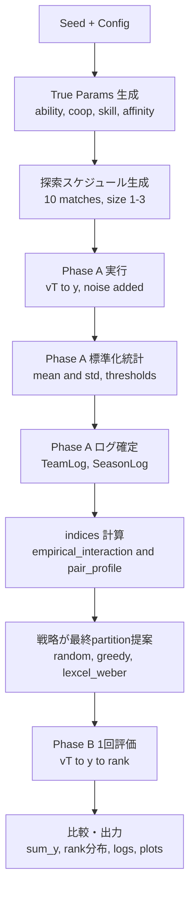

# sim_contribution（観測ログベースのチーム編成シミュレーション）

本プロジェクトは、以下の2フェーズのプロトコルを Python で再現します。

- Phase A（探索・固定10試合）: 事前に生成した探索スケジュールに従い、チーム観測ログ（観測テーブル）を作成
- Phase B（最終評価・1回）: Phase A ログのみから指標を計算し、各戦略が最終1回の組分けを提案 → その1回の合計観測スコア `Σy` で比較

重要注意（仕様どおり）:

- `indices/` にある「経験的相互作用スコア」は、後続研究で扱う「貢献度指標（本命指標）」そのものではありません。Phase A の観測ログから計算可能な**意思決定用の経験的スコア**です。
- 戦略は **Phase A の観測ログのみ**を入力にします（プレイヤー真値パラメータは禁止）。

## 実行コマンド

`sim_contribution/` ディレクトリで実行します。

```bash
poetry install
poetry run python scripts/run_one_season.py --seed 42 --outdir outputs
```

- `--seed`: 乱数 seed（`numpy.random.Generator` で再現可能）
- `--outdir`: 出力先ディレクトリ（存在しなければ作成）

## 入出力・生成物（出力先）

`--outdir` に以下を出力します（例: `sim_contribution/outputs/`）。

- ログ（Phase A）
  - `phase_a_log.json`（SeasonLog: 全試合・全チームの観測ログ + Phase A の標準化統計）
  - `phase_a_teams.csv`（チームごとの行形式）
- 指標一覧（Phase A終了時点）
  - `phase_a_indices.json`（提携 |T|=1..3 の全組合せに対する、観測ベース指標の一覧。計算不能な項目は `null`）
  - `phase_a_indices.csv`（同上の表形式）
- ログ（Phase B）
  - `phase_b_results.json`（戦略ごとの最終評価結果）
  - `phase_b_random.csv`
  - `phase_b_greedy_interaction.csv`
  - `phase_b_lexcel_weber.csv`
- 真値パラメータ（分析用。戦略入力には使わない）
  - `true_params.json`（ability/cooperativeness/skill/affinity）
- 図（PNG）
  - `players.png`（プレイヤー属性の真値: ability, cooperativeness, skill, affinity）
  - `phase_a_teams.png`（Phase A の試合×チーム一覧）
  - `phase_a_breakdown.png`（Phase A の上位/下位チームの内訳）
  - `phase_b_partitions.png`（Phase B の戦略別チーム内訳）
  - `phase_b_summary.png`（Phase B の `Σy` とランク分布）

標準出力（stdout）には、戦略別に以下をサマリ表示します。

- `total_y`（Phase B の合計観測スコア `Σy`）
- `ranks`（A〜E の個数）
- `partition`（採用されたチーム分け）

## シミュレーションの流れ

### 1) 真値パラメータ生成（プレイヤー）

- 人数 `N=10`
- ability `a_i ~ Normal(0,1)`
- cooperativeness `c_i ~ Normal(0,1)`（負もあり）
- skill vector `s_i` は `K=5` 次元の標準正規
- pair affinity `h_{i,j} ~ Normal(0, σ_h)` を上三角生成して対称化

### 2) 探索スケジュール生成（Phase Aの10試合を固定）

`schedule/` で探索用の 10 試合分の partition を生成します。

- チームサイズは `1〜3`
- 各プレイヤーは 10 試合で **最低1回は単独（サイズ1）** を経験するように強制（満たせない場合は警告）
- できる範囲でサイズ2/3の経験やペア露出を増やす（soft）

### 3) 生成モデル v(T) と観測モデル y（Phase A）

チーム `T` の真の生産性:

```
v(T) = sum(a_i)
     + lambda_div * D(T)
     + sum_{i<j in T} h_{i,j}
     + lambda_coop * (sum(c_i)) * g(|T|)
     - kappa * comb(|T|, 2)
```

- 多様性 `D(T) = 1 - mean_cosine_similarity`（|T|<2なら mean=0）
- 通信コスト `kappa * comb(|T|,2)` を減算

観測スコア:

```
y = v(T) + ε,  ε ~ Normal(0, sigma_noise)
```

### 4) ランク付与（Phase Aで確定 → Phase Bも同じ基準）

1. Phase A の全チーム観測 `y` を集める
2. 標準化 `z = (y - mean_y) / std_y`（std=0なら1扱い）
3. 固定閾値で A〜E を割当（デフォルトは `config.py`）

Phase B（最終評価）の z/ランクは、Phase A で確定した `mean_y/std_y/thresholds` を使って付与します。

### 5) 指標計算（観測ログのみ）

- `indices/empirical_interaction.py`: 観測済みチーム（|T|=1..3）に経験的相互作用スコアを付与
  - `mean_y(T)`（Tが観測されたときの `y` 平均）
  - `base(|T|)`（同サイズチームの `y` 平均）
  - `raw = mean_y(T) - base(|T|)`
  - shrinkage: `w = n/(n+alpha)`, `score = w*raw`
- `indices/pair_profile.py`: ペア (i,j) のランク分布ベクトル `(A,B,C,D,E)` を集計（戦略2用）

### 6) 戦略が最終組分けを提案（Phase Aログのみ）

- `random`: サイズ1〜3のランダム partition
- `greedy_interaction`: 経験的相互作用スコアの高いチームから重複なしで貪欲採用し、残りを埋める
- `lexcel_weber`: 2人×5固定。ペアのランク分布を Lexcel（辞書式）比較で順位付けし、上位から重複なしで採用

### 7) 最終評価（Phase Bを各戦略1回だけ）

各戦略の提案 partition を 1回だけ実行して `Σy` を比較します（参考でランク分布も出力）。

## フロー図（Mermaid）



## 設定を変更したいとき（どこをいじるか）

基本は `sim_contribution/src/sim_contribution/config.py` の `Config` を編集します。

- 分布・人数・次元: `n_players`, `skill_dim`, `ability_std`, `coop_std`, `sigma_h`
- Abilityを正にする: `ability_positive`（デフォルト `True`）
- 生成モデル係数: `lambda_div`, `lambda_coop`, `kappa`, `g_map`
- 観測ノイズ: `noise_sigma`
- ランク閾値: `rank_thresholds`
- 経験的相互作用の shrinkage: `interaction_alpha`
- 貪欲のサイズ優先: `greedy_size_priority`
- スケジュール探索の試行回数: `schedule_candidates`

CLI から設定を切り替える実装は現状入れていないため、設定変更は `Config()` のデフォルトを書き換える想定です（必要なら CLI 化も追加できます）。

## よくある注意

- `matplotlib` のキャッシュディレクトリが書き込み不可だと警告が出ることがあります。その場合は環境変数 `MPLCONFIGDIR` を書き込み可能な場所に設定してください。
